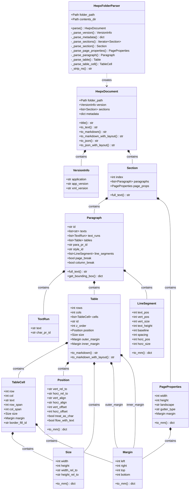
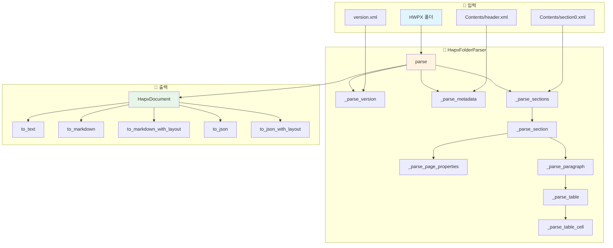
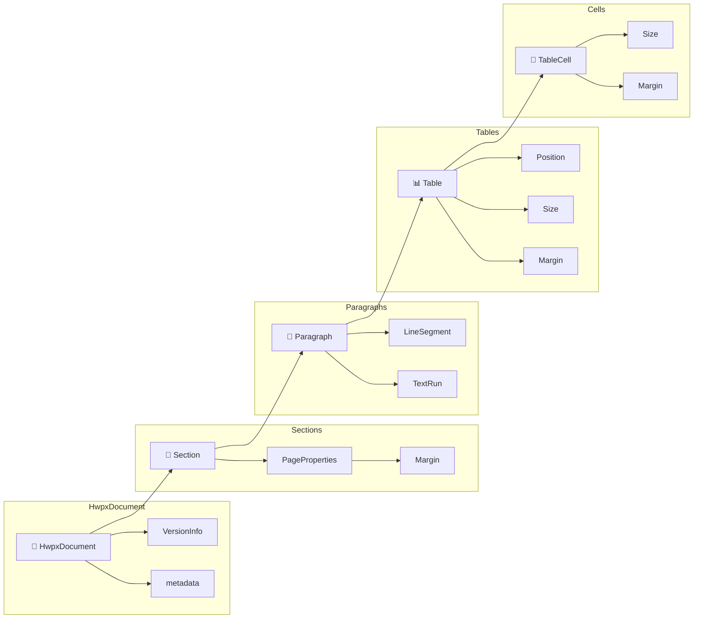
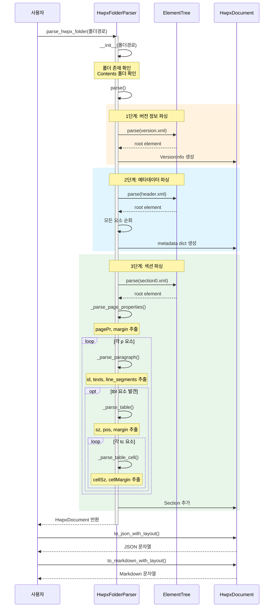
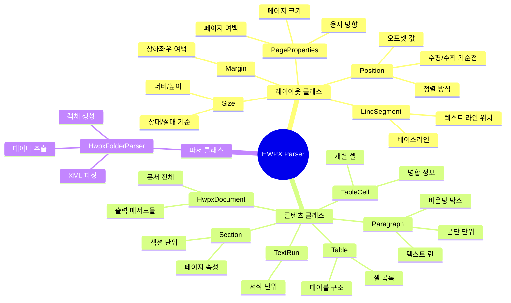
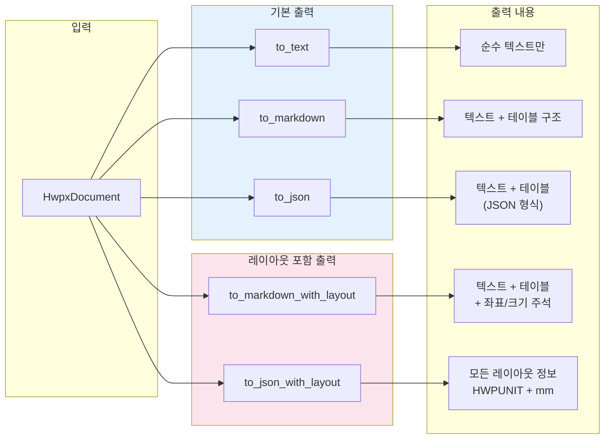
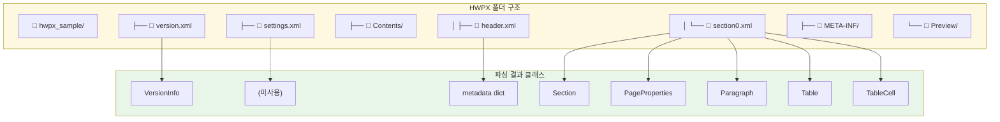
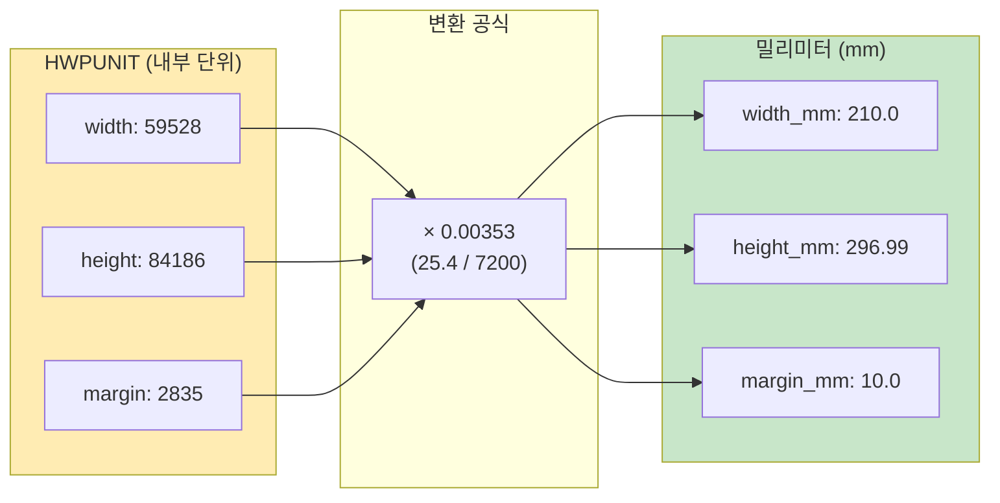

# HWPX Parser 코드 구조 다이어그램

이 문서는 `hwpx_folder_parser_cursor.py`의 클래스와 함수 구조를 시각화합니다.

---

## 1. 클래스 계층 구조 (Class Hierarchy)



---

## 2. 파싱 플로우 (Parsing Flow)



---

## 3. 데이터 구조 관계 (Data Structure Relationships)



---

## 4. XML 파싱 상세 흐름 (XML Parsing Detail)



---

## 5. 주요 클래스별 역할



---

## 6. 출력 형식 비교



---

## 7. 파일 구조와 클래스 매핑



---

## 8. 좌표 단위 변환



---

## 사용 방법

### 다이어그램 보기

1. **GitHub**: 이 파일을 GitHub에 push하면 자동으로 렌더링됩니다.

2. **VS Code**: "Markdown Preview Mermaid Support" 확장 설치 후 미리보기

3. **온라인**: [Mermaid Live Editor](https://mermaid.live/)에 코드 복사

### 코드 사용 예시

```python
from hwpx_folder_parser_cursor import parse_hwpx_folder

# 1. 폴더 파싱
doc = parse_hwpx_folder("results/hwpx_sample")

# 2. 기본 텍스트 추출
text = doc.to_text()

# 3. 레이아웃 포함 JSON
json_data = doc.to_json_with_layout()

# 4. 레이아웃 포함 마크다운
markdown = doc.to_markdown_with_layout()
```


